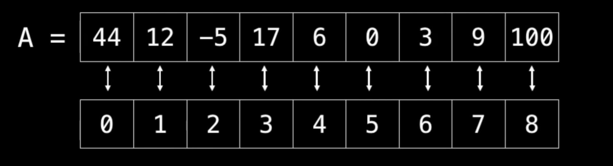

# Data Structure and Algorithm (DSA)

Data structures and algorithms are the identity of a good programmer. They are a very important foundation of programming, so don't leave them out. You don't have to be the best and you don't have to know every data structure or algorithm, but you should have an overview.

## What is DSA?

Data structures and algorithms are the two things that will completely change your approach to programming.
Data structures help us store data in a specific format, and algorithms are nothing more than the process you implement to solve a specific problem.

## Why is DSA important?

DSA plays a very important role in reducing the time complexity of code. There can be multiple approaches to a problem, but you have to choose the optimal one to stand out from the crowd. You have to be able to write code that takes less time to execute for a given problem. You can do this by learning DSA. If you master DSA properly, you will be able to write better code.

</br>

# Topics to Study

- [Algorithmic complexity / Big-O / Asymptotic analysis](#algorithmic-complexity--big-o--asymptotic-analysis)

- [Data Structures](#data-structures)
  - [Array](#array)
  - [Linked List](#linked-list)
  - Stack
  - Queue
  - Hash Table
  - Binary Tree
  - Binary Search Tree
  - Heap 
  - Graph
  - Matrix
  - Advanced Data Structures

- Algorithms

</br>
</br>

# Let's Get Started
<!---
Text here maybe motivation or so
--->

</br>
</br>

# Algorithmic complexity / Big-O / Asymptotic analysis

Before we get into DSA, let's first have a look at Big-O.

I have left you a few videos that you can use to learn. Watch as many as you want until you understand everything. If you don't understand everything right away, it doesn't matter, you can always come back and watch everything again in detail.

<br />

- [ ] [Hackerrank Basics of Big-O](https://www.youtube.com/watch?v=v4cd1O4zkGw)
- [ ] [Introduction to Big O Notation and Time Complexity by CS Dojo](https://www.youtube.com/watch?v=D6xkbGLQesk)
- [ ] [Havard Asymptotic Notation](https://www.youtube.com/watch?v=iOq5kSKqeR4)
- [ ] [UC Berkeley Big O](https://archive.org/details/ucberkeley_webcast_VIS4YDpuP98)

<br />

As programmers, we often find ourselves asking the same two questions over and over agian:
- How much time does this alogrithm need to finish?
  </br>
   and
- How much space does this algorithm need for its computation?
  
With Big-O Notation we can get an idea of the complexity of our algorithms

<br />

**Constant Time: O(1)**

O(1) means that it takes a constant time to run an algorithm, regardless of the size of the input.

Examples:
- math operations
- accessing array via the index
- returning a value from a funtion 

<br />

**Logarithmic Time: O(log n)**

O(log n) means that the runtime grows in proportion to the logarithm of the input size, e.g., if 10 items take a time of x, then 100 items take a time of 2x and 10,000 items take a time of 4x. Algorithms that run in logarithmic time have a large impact when dealing with larger inputs.

Example: 
```
   for (int i = 1; i <=n; i *= 2) {
       // some O(1) expressions
   }
   for (int i = n; i > 0; i /= 2) {
       // some O(1) expressions
   }
```
</br>

**Linear Time: O(n)**

O(n) means that the runtime increases at the same rate as the input.

Example: 
```
   for (int i = 1; i <= c; i++) {  
        // some O(1) expressions
   }
```
<br />

**Quadratic Time: O($n^2$)**

O(n²) means that the calculation runs in quadratic time, which corresponds to the squared size of the input data.

Example: 
```
      for (int i = 1; i <= n; i += 1) {  
        // some O(1) expressions
   }

   for (int i = n; i > 0; i -= 1) {
        // some O(1) expressions
   }
```


<br />


Above I have now shown you only the most important on the picture you can see the remaining

</br>


<br />
<br />
<br />

# Data Structures

## What is a Data Structure? 

A data structure (DS) is a way of organizing data so that it can be used effectively

## Why we need them?

- They are essantial ingredients in creating fasr and powerful alogrithms
- They help to manage and organize data
- They make code cleaner and easier to understand

---

## Array

There are two types of arrays static and dynamic, let's start with the static one first.

</br>

A static array is a fixed length container that can contain n elements that are indexable. The index of an array always starts at 0 and goes to the n-1th element, because we have to count the 0.

If you are wondering what indexable means.

This means that each slot/index in the array can be referenced with a number.

### When and where is a static Array used?

Array are used everywhere. We use them to: 
- store and accessing sequential data
- temporarily storing objects
- return multiple values from a function/method

Strengths:
- **Fast lookups:** Retrieving the element at a given index takes O(1) time, regardless of the length of the array.
- **Fast appends:** Adding a new element at the end of the array takes O(1) time, if the array has space.

Weaknesses:
- **Fixed size:** You need to specify how many elements you're going to store in your array ahead of time. (Unless you're using a fancy dynamic array.)
- **Costly inserts and deletes:** You have to "scoot over" the other elements to fill in or close gaps, which takes worst-case O(n) time.

</br>

### Complexity 

|              | Static        |
|--------------| --------------|
| Access       | O(1)          |
| Search       | O(n)          |
| Insertion    | O(n)          |
| Appending    | O(1)          |
| Deletion     | O(n)          |

</br>



In this image we see an array named A. All elements of A are referenced by their index. Array indexing is based on zero, which means that the first element is found at position zero. So keep in mind to count the zero when you work with arrays.

Lets accessing some elements from our array.

```
A[0] = 44
A[1] = 12
A[8] = 100
```

You can also access all elements by loop over the Array
Here a example in Java

```
for (int i = 0; i < arr.length; i++)
   System.out.print(A[i] + " ");
}

// OUTPUT: 44 12 -5 17 6 0 3 9 100
```

If we now want to change a element in the Array, than we can do this also by indexing.

```
A[0] = 1;    // A[0] has now the value 1
```

Now lets move on dynamic Arrays

</br>

### Dynamic Arrays

A dynamic array is also a container that can contain n elements that are indexable, but the difference with static arrays is that the size of a dynamic array can change at runtime.

Strengths:
- **Fast lookups:** Just like arrays, retrieving the element at a given index takes O(1) time.
- **Variable size:** You can add as many items as you want, and the dynamic array will expand to hold them.
- **Cache-friendl:** Just like arrays, dynamic arrays place items right next to each other in memory, making efficient use of caches.

Weaknesses
- **Slow worst-case appends:** Usually, adding a new element at the end of the dynamic array takes O(1) time. But if the dynamic array doesn't have any room for the new item, it'll need to expand, which takes O(n) time.
- **Costly inserts and deletes:** Just like arrays, elements are stored adjacent to each other. So adding or removing an item in the middle of the array requires "scooting over" other elements, which takes O(n) time.

### Complexity 

|              | Dynamic     |
|--------------| ------------|
| Access       | O(1)        |
| Search       | O(n)        |
| Insertion    | O(n)        |
| Appending    | O(1)        |
| Deletion     | O(n)        |


Let's implement a dynamic array ourselves in Java with a static Array.

What we need to store in our Class variables? 

arr: This is our array
capacity: size of the array 
size: number of elements that are currently stored

We also need some basic operations for our dynamic array Class:

- getSize(): returns the number of elements stored in our array
- getCapacity(): returns capacity of array (number of items it can hold)
- isEmpty(): returns true if array contains no elements
- contains(element): returns true if array contains specified element
- get(index): returns element at the specified index
- set(index, element): replaces the element at the specified position
- add(element): adds element to the end of the array
- remove(element): removes all elements that are the same as specified element
- removeAt(index): removes element at specified index
- pop(): removes last element in array
- resize(new_capacity): // private function
  - when you reach capacity, resize to double the size
  - when popping an item, if size is 1/4 of capacity, resize to half

</br>

<details>
<summary>Code</summary>
First we need to create a our DynamicArray class with a generic <E> this tells the class which type of elements we want to store in our array. Next we define some variables and a constant:
- DEFAULT_CAPACITY
- capacity
- size
- and a Object array

We also define a custom constructor for our class.

```
/**
 * This class implements a dynamic array with a static Array
 *
 * @param <E> is the type of the array
 */
public class DynamicArray<E> {

    // default capacity of array
    private static final int DEFAULT_CAPACITY = 16;

    private int capacity; // size of the array
    private int size; // number of elements  that are currently stored
    private Object[] elements; // our array

    /**
     * constructor
     * 
     * @param capacity the starting length of the array
     */
    public DynamicArray(final int capacity) {
        this.capacity = capacity;
        this.size = 0;
        this.elements = new Object[this.capacity];
    }

    /** No-args constructor */
    public DynamicArray() {
        this(DEFAULT_CAPACITY);
    }
}
```
The first method we implement is resize. If the size of our array reaches capacity than double the capacity. If size is 1/4 of capacty than divide capacity by 2. 
We will implement that logic in every method where we add or remove elements to the array.
The resize method looks like this:
```
    private void resize(int new_capacity) {

        Object[] temp = new Object[new_capacity];

        for (int i = 0; i < this.size; i++) {
            // copy all array value into temp
            temp[i] = this.elements[i];
        }

        setElements(temp);

        setCapacity(new_capacity);
    }
```

getSize and getCapacity or typical getter methods
```
    public int getCapacity() {
        return capacity;
    }

    public int getSize() {
        return size;
```
The other methods of our DynamicArray class look like this

```
    /**
     * @return true if array contains no elements (size == 0)
     */
    public boolean isEmpty() {
        return this.size <= 0;
    }

    /**
     * @param element to search for in array
     * @return true if array contains specified element
     */
    public boolean contains(E element) {
        for (int i = 0; i < this.size; i++) {
            if (element == this.elements[i]) {
                return true;
            }
        }
        return false;
    }

    /**
     * method returns element at the specified index
     *
     * @param index in array
     * @return element at the specified index
     */
    public E get(int index) {
        return (E) this.elements[index];
    }

    /**
     * replaces the element at the specified position
     *
     * @param index   in array
     * @param element element to put in array
     */
    public void set(int index, E element) {
        if (index > size || index < 0) {
            throw new IndexOutOfBoundsException();
        }
        this.elements[index] = element;
    }

    /**
     * adds element at the end of the array, if full call resize and double the capacity
     *
     * @param element to be inserted
     */
    public void add(E element) {
        if (this.size == this.elements.length) {
            resize(2 * this.capacity);
        }
        this.elements[this.size] = element;
        size++;
    }

    /**
     * removes all elements that are the same as specified element
     * if size is 1/4 of capacity, resize array to half
     *
     * @param element to be removed
     */
    public void remove(E element) {
        // check if array is not empty
        if (size > 0 && contains(element)) {
            for (int i = 0; i < this.size; i++) {
                if (element == this.elements[i]) {
                    removeAt(i);
                }
            }
            if (size * 4 <= this.capacity) {
                resize(capacity / 2);
            }
        }
    }

    /**
     * removes all elements that are the same as specified element
     * if size is 1/4 of capacity, resize array to half
     *
     * @param index of the element to be deleted
     */
    public void removeAt(int index) {
        if (index > size || index < 0) {
            throw new IndexOutOfBoundsException();
        }
        // check if array is not empty
        if (size > 0) {
            for (int i = index; i < this.size - 1; i++) {

                // shift all element of right
                // side from given index in left
                this.elements[i] = this.elements[i + 1];
            }
            this.elements[this.size - 1] = null;
            size--;


            if (size * 4 <= this.capacity) {
                resize(capacity / 2);
            }
        }
    }

    /**
     * method deletes last element of array
     * if size is 1/4 of capacity, resize array to half
     */
    public void pop() {
        // check if array is not empty
        if (size > 0) {
            this.elements[this.size] = null;
            this.size--;

            if (size * 4 <= this.capacity) {
                resize(capacity / 2);
            }
        }
    }
```
</details>

</br>

<details>
<summary>Tests</summary>

    public static void main(String[] args) {
        DynamicArray<Integer> arr = new DynamicArray<Integer>(1);

        // test for resize
        System.out.println("size: "+ arr.getSize()); // size: 0
        System.out.println("capacity: "+ arr.getCapacity()); // capacity: 1
        arr.add(1);
        arr.add(54);
        arr.add(3);
        System.out.println("size: "+ arr.getSize()); // size: 3
        System.out.println("capacity: "+ arr.getCapacity()); // capacity: 4 -> capacity doubled 2 times
        arr.pop();
        arr.pop();
        System.out.println("size: "+ arr.getSize()); // size: 2
        System.out.println("capacity: "+ arr.getCapacity()); // capacity: 2

        arr.add(1);
        arr.add(454);
        arr.add(7);
        arr.add(2);
        arr.add(4);
        arr.add(0);
        arr.add(19);
        arr.add(8);
        arr.add(21);

        // isEmpty test
        System.out.println(arr.isEmpty()); // false

        // contains test
        System.out.println(arr.contains(3)); // true
        System.out.println(arr.contains(4)); // false

        // get test
        System.out.println("index 0: "+ arr.get(0)); // 1

        // set test
        arr.set(0,2);
        System.out.println("index 0: "+ arr.get(0)); // 2


        System.out.println("\nRemove Test:");
        // remove test
        for (int i = 0; i<arr.getSize(); i++){
            System.out.println(arr.get(i)); //[2,1,454,7,2,4,0,19,8,21]  two times the number 2 is in the array lets remove it
        }

        System.out.println("size: "+ arr.getSize()); // size: 10
        System.out.println("capacity: "+ arr.getCapacity()); // capacity: 16

        arr.remove(2);
        for (int i = 0; i<arr.getSize(); i++){
            System.out.println(arr.get(i)); // [1,454,7,4,0,19,8,21]
        }

        System.out.println("size: "+ arr.getSize()); // size: 8
        System.out.println("capacity: "+ arr.getCapacity()); // capacity: 16

        // removeAt Test
        arr.removeAt(1);
        for (int i = 0; i<arr.getSize(); i++){
            System.out.println(arr.get(i)); // [1,7,4,0,19,8,21]
        }

        System.out.println("size: "+ arr.getSize()); // size: 7
        System.out.println("capacity: "+ arr.getCapacity()); // capacity: 16

        // pop Test
        arr.pop();
        for (int i = 0; i<arr.getSize(); i++){
            System.out.println(arr.get(i)); // [1,7,4,0,19,8]
        }

        System.out.println("size: "+ arr.getSize()); // size: 6
        System.out.println("capacity: "+ arr.getCapacity()); // capacity: 16

    }
</details>  

</br>

[Full Code](../dsa/data-structures/arrays/DynamicArray.java)

---
</br>


## Linked List

A linked list is a linear data structure like an array. However, the elements are not stored in a contiguous location. The elements in a linked list are linked using pointers or references.

In simple words, a linked list consists of nodes where each node contains a data field and a reference(link) to the next node in the list.

### Why Linked Lists? 

1. The size of the arrays is fixed: So we must know the upper limit on the number of elements in advance. Also, generally, the allocated memory is equal to the upper limit irrespective of the usage. 
2.  Inserting a new element in an array of elements is expensive because the room has to be created for the new elements and to create room existing elements have to be shifted. 


Strengths:
- **Dynamic Size:** The size of a linked list can change by runtime
- **Ease of insertion/deletion:** 
- **Cache-friendl:** Just like arrays, dynamic arrays place items right next to each other in memory, making efficient use of caches.

Weaknesses
- **Random access:** is not allowed. We have to access elements sequentially starting from the first node.
- **Extra memory space:** for a pointer is required with each element of the list. 
- **Not cache friendly:** Since array elements are contiguous locations, there is locality of reference which is not there in case of linked lists.

### Complexity

|              | Linked List   | 
|--------------| --------------|
| Search       | O(n)          | 
| Insertion    | O(n)          | 
| Appending    | O(1)          |
| Deletion     | O(n)          | 